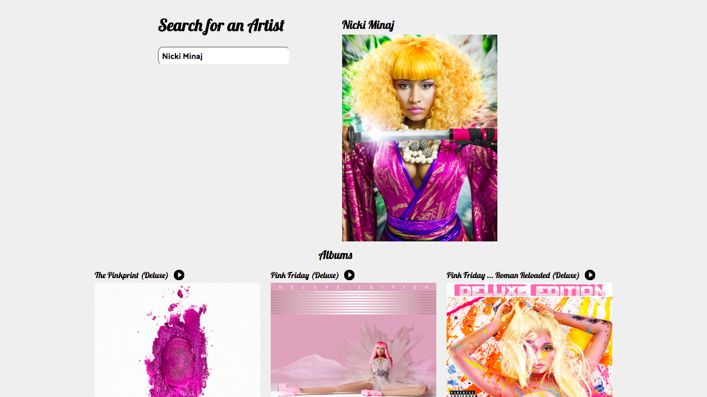

# Artist Spot

###[Link to Artist Spot](http://analyst-mistake-86784.bitballoon.com/)

This application allows the user to search for a music artist using the public Spotify API. A successful search will result in displaying the artist's photo as well as the photos of all of the artist's albums available on Spotify. The user is also able to play a preview track from each of the albums. Enjoy!.

Artist Spot was developed using Javascript, AJAX, Flexbox CSS.

## Artist Spot Features

- [ ] Asynchronous/dynamic typeahead search linked to public Spotify API
- [ ] Search result displays artist's name, photo, and albums.
- [ ] User may play preview track from each album.

## Views



####Sample Code Snippet:

######Type Ahead Search Feature

```javascript

function typeAheadArtist(result, query){
    document.getElementById("search-box").style.height = "auto";

    if(result.artists.total != 0){
      var artistNames = [];
      result.artists.items.forEach(artist => artistNames.push(artist.name))
      artistNames = artistNames.filter(function(name){
        var re = new RegExp(query);
        var reCapitalize = new RegExp(capitalizeFirstLetter(query));
        return re.test(name) || reCapitalize.test(name);
      });

      for (var key in artistNames) {
        var optionElement = document.createElement("option");
        optionElement.value = artistNames[key];
        optionElement.innerHTML = artistNames[key];
        document.getElementById("results").appendChild(optionElement);
      }
    }
}

```

######AJAX for Artist Search

```javascript

var searchArtists = function (query) {
    $.ajax({
        url: 'https://api.spotify.com/v1/search',
        data: {
            q: `${query}*`,
            type: 'artist'
        },
        success: function (response) {
          typeAheadArtist(response, query);
        }
    });
};
